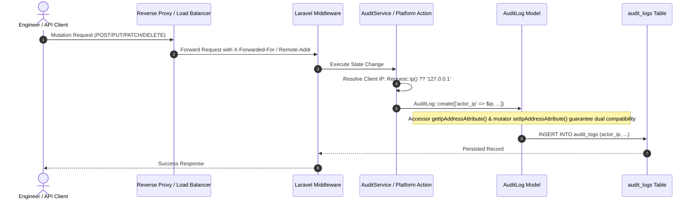

# Immutable Audit Trail & Client IP Provenance

> **Module:** `/admin/platform/audit`  
> **Service:** `App\Services\AuditService`  
> **Model:** `App\Models\AuditLog` (`audit_logs` table)  
> **API Endpoints:** `GET /api/v1/audit-logs`, `GET /api/v1/platform/audit-logs`

## 1. Overview & Compliance Standard

In accordance with strict SRE compliance standards, multi-tenant security requirements, and enterprise SOC-2 guidelines, every state mutation across Opsora generates an immutable, cryptographically timestamped audit log entry. Audit logs are write-only and cannot be altered or purged by ordinary administrators or tenants.

---

## 2. Client IP Resolution & Provenance Pipeline

To guarantee non-repudiation and forensic provenance, client IP addresses are extracted server-side and recorded on every mutation.



### 2.1 Database & Model Mapping
- **Database Column:** `actor_ip VARCHAR(45) NULL` (supports IPv4 and full IPv6 addresses).
- **Model Accessor:** `getIpAddressAttribute()` returns `$this->actor_ip ?? $this->attributes['ip_address'] ?? '127.0.0.1'`.
- **Model Mutator:** `setIpAddressAttribute($value)` assigns `$this->attributes['actor_ip'] = $value`.
- **Mass Assignment:** Both `actor_ip` and `ip_address` are registered in `$fillable`.
- **API Resource:** `AuditLogResource` outputs both `actor_ip` and `ip_address` for seamless client compatibility.

---

## 3. Log Record Schema

Each audit log entry captures:

| Column | Type | Description |
|---|---|---|
| `id` | `BIGINT UNSIGNED` | Auto-incrementing primary key |
| `workspace_id` | `BIGINT UNSIGNED NULL` | Tenant workspace scope (null for platform-level mutations) |
| `actor_id` | `BIGINT UNSIGNED NULL` | Foreign key to `users` table |
| `actor_name` | `VARCHAR(255)` | Denormalized snapshot of actor's name at mutation moment |
| `actor_role` | `VARCHAR(50) NULL` | Denormalized snapshot of actor's role (`admin`, `lead`, `agent`) |
| `actor_ip` | `VARCHAR(45) NULL` | Validated IPv4 / IPv6 client network origin |
| `subject_type` | `VARCHAR(255)` | Morphable model class (e.g. `App\Models\User`, `App\Models\Workspace`) |
| `subject_id` | `BIGINT UNSIGNED` | ID of the mutated record |
| `event` | `VARCHAR(50)` | Verb: `created`, `updated`, `status_changed`, `deleted`, `user_privileges_updated`, `platform_role_changed` |
| `old_values` | `JSON NULL` | Pre-mutation attribute snapshot |
| `new_values` | `JSON NULL` | Post-mutation attribute snapshot |
| `created_at` | `TIMESTAMP` | Immutable creation timestamp |

---

## 4. UI Representation in Platform Control Plane

In `/admin/platform/audit`, each record displays:
1. **Timestamp & Date:** Formatted with UTC relative tooltips.
2. **Actor Profile:** Name with email subtitle and link to user directory.
3. **Action / Event:** Color-coded status badge (e.g., `CREATED`, `STATUS_CHANGED`, `USER_PRIVILEGES_UPDATED`).
4. **Subject Entity:** Model class basename with ID badge (e.g., `User #4`, `Workspace #2`).
5. **State Diff / Payload:** Collapsible JSON delta showing changed keys.
6. **Client IP Badge:** High-contrast, monospace badge with network globe icon:
   ```html
   <span class="inline-flex items-center gap-1.5 px-2.5 py-1 rounded-md bg-gray-100 dark:bg-white/10 text-gray-800 dark:text-gray-200 font-mono text-[11px] font-semibold border border-gray-200 dark:border-white/10 shadow-xs">
       <svg class="w-3.5 h-3.5 text-gray-400">...</svg>
       127.0.0.1
   </span>
   ```

---

## 5. Search & Filtering Capabilities

The Global Platform Audit Trail provides:
- **Free-Text Search:** Automatically matches actor name, event type, subject type, or IP address (`actor_ip`).
- **Event Filter:** Dropdown populated dynamically with distinct persisted event verbs.
- **Date Range Picker:** Filter by `from` and `to` ISO dates.
- **Pagination:** 25 records per page with query string preservation.
