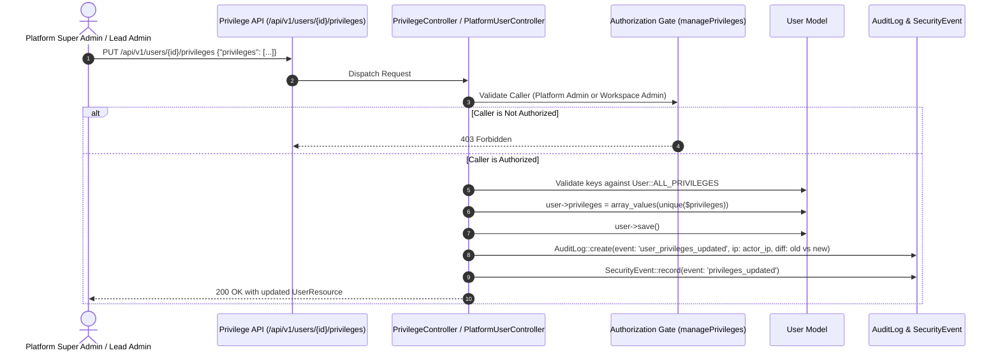

# Platform Roles & Granular Privileges Architecture

> **Models:** `App\Enums\PlatformRole`, `App\Models\User` (`ALL_PRIVILEGES`)  
> **API Endpoints:** `GET /api/v1/privileges`, `PUT /api/v1/users/{id}/privileges`  
> **Web Route:** `PATCH /admin/platform/users/{id}/privileges`  
> **Rule:** Principle of Least Privilege & Immutable Audit Provenance

---

## 1. Two-Tier Authorization Architecture

Opsora enforces a strict two-tier authorization system:
1. **Tier 1 — Platform Administrative Roles (`platform_role`)**: Fleet-wide control plane permissions for managing tenant organizations, subscriptions, system health, and cross-tenant policies.
2. **Tier 2 — Granular Operational Privileges (`privileges`)**: Granular, capability-based permissions governing actions within tenant organizations and workspaces (e.g. executing runbooks, signing handovers, managing billing, exporting reports).

```mermaid
flowchart TD
    User["Authenticated User (User Model)"]

    subgraph Tier1["Tier 1: Platform Administrative Roles"]
        PlatformRoleEnum["App\\Enums\\PlatformRole"]
        SuperAdmin["Super Admin (Root)"]
        PlatformAdmin["Platform Administrator"]
        PlatformOps["Platform Operations"]
        SecurityAdmin["Security Administrator"]
        BillingAdmin["Billing Administrator"]
        SupportAdmin["Support Administrator"]
        Auditor["Compliance Auditor"]
    end

    subgraph Tier2["Tier 2: Granular Operational Privileges (18 Capabilities)"]
        OpsGroup["Operations & Runbooks"]
        ShiftGroup["Shift Management & Handovers"]
        IncGroup["Incident Response & Post-Mortem"]
        TenGroup["Multi-Tenancy & Workspaces"]
        BillGroup["Commercial Billing"]
        SecGroup["SIEM Security & Audit"]
        GovGroup["Platform & User Governance"]
        CommsGroup["War Rooms & Announcements"]
        CompGroup["Compliance Purges & Archival"]
        RepGroup["Reporting & Data Export"]
    end

    User -->|evaluates platform_role| Tier1
    User -->|evaluates privileges[] & role defaults| Tier2

    Tier1 -->|Unlocks| ControlPlaneRoutes["/admin/platform/*<br/>EnsurePlatformAdmin Middleware"]
    Tier2 -->|Unlocks| TenantActions["Activity mutations, runbook execution, handovers, billing updates"]
```

---

## 2. Platform Administrative Roles (Tier 1)

| Platform Role | Enum Value | Intended Operator Responsibility |
|---|---|---|
| **Super Admin** | `super_admin` | Unrestricted platform operator; manages all resources, settings, roles, and emergency policies. |
| **Platform Administrator** | `platform_admin` | Manages tenant organizations, user accounts, plans, feature flags, and diagnostics. |
| **Platform Operations** | `platform_ops` | Infrastructure and telemetry operator; monitors health, workspaces, and deployments. |
| **Security Administrator** | `security_admin` | Governs SIEM security events, performs user suspensions, inspects audit logs. |
| **Billing Administrator** | `billing_admin` | Manages commercial SaaS plans, organization subscriptions, and revenue intelligence. |
| **Support Administrator** | `support_admin` | Investigates customer inquiries, views organization workspaces and service health. |
| **Compliance Auditor** | `auditor` | Read-only compliance officer; reviews immutable audit logs and SLA compliance records. |

### Platform Roles Permission Matrix

```text
Permission                       SuperAdmin  PlatformAdmin  PlatformOps  SecurityAdmin  BillingAdmin  SupportAdmin  Auditor
platform.dashboard.view              ✅           ✅            ✅             ✅             ✅            ✅         ✅
platform.users.view                  ✅           ✅            ✅             ✅             ❌            ✅         ✅
platform.users.manage                ✅           ✅            ❌             ✅             ❌            ❌         ❌
platform.organizations.view          ✅           ✅            ✅             ✅             ✅            ✅         ✅
platform.organizations.manage        ✅           ✅            ❌             ❌             ❌            ❌         ❌
platform.organizations.suspend       ✅           ✅            ❌             ✅             ❌            ❌         ❌
platform.workspaces.view             ✅           ✅            ✅             ✅             ❌            ✅         ✅
platform.workspaces.manage           ✅           ✅            ❌             ❌             ❌            ❌         ❌
platform.plans.view                  ✅           ✅            ❌             ❌             ✅            ❌         ❌
platform.plans.manage                ✅           ✅            ❌             ❌             ✅            ❌         ❌
platform.subscriptions.view          ✅           ✅            ❌             ❌             ✅            ❌         ❌
platform.subscriptions.manage        ✅           ✅            ❌             ❌             ✅            ❌         ❌
platform.features.view               ✅           ✅            ✅             ❌             ❌            ❌         ❌
platform.features.manage             ✅           ✅            ❌             ❌             ❌            ❌         ❌
platform.health.view                 ✅           ✅            ✅             ✅             ❌            ❌         ❌
platform.security.view               ✅           ✅            ❌             ✅             ❌            ❌         ❌
platform.security.manage             ✅           ❌            ❌             ✅             ❌            ❌         ❌
platform.audit.view                  ✅           ✅            ❌             ✅             ❌            ❌         ✅
platform.reports.view                ✅           ✅            ✅             ❌             ✅            ❌         ✅
platform.settings.manage             ✅           ❌            ❌             ❌             ❌            ❌         ❌
```

---

## 3. Granular Operational Privileges Catalog (Tier 2)

The system maintains 18 distinct capability keys defined in `App\Models\User::ALL_PRIVILEGES`:

| Key | Category | Label | Description | Lead Default | Agent Default |
|---|---|---|---|:---:|:---:|
| `manage_activities` | Operations | Manage Activities | Create, edit, and configure operational checks | ✅ | ❌ |
| `assign_tasks` | Operations | Delegate & Reassign Tasks | Delegate checks to engineers individually or in bulk | ✅ | ❌ |
| `execute_runbooks` | Operations | Execute SRE Runbooks | Trigger automated remediation runbooks and failovers | ✅ | ✅ |
| `sign_handovers` | Shift Management | Sign Shift Handovers | Draft and digitally sign off SRE shift handover briefings | ✅ | ❌ |
| `accept_handovers` | Shift Management | Accept & Sign-On Handovers | Formally acknowledge and accept incoming handovers | ✅ | ❌ |
| `escalate_incidents` | Incident Response | Flag Incidents & Escalations | Escalate operational checks and attach incident tickets | ✅ | ✅ |
| `resolve_incidents` | Incident Response | Resolve Incidents & Post-Mortem | Formally declare incidents resolved and publish RCAs | ✅ | ❌ |
| `manage_workspaces` | Multi-Tenancy | Manage Workspaces | Provision, configure, switch, and archive workspaces | ✅ | ❌ |
| `manage_billing` | Commercial | Subscription & Billing Access | View invoices, plan tiers, receipts, and quotas | ❌ | ❌ |
| `view_audit_logs` | Security & Compliance | View Security Audit Trails | Inspect immutable audit logs and state mutation diffs | ✅ | ❌ |
| `manage_security` | Security & Compliance | SIEM & Security Telemetry | Inspect security events and revoke compromised tokens | ❌ | ❌ |
| `manage_feature_flags` | Platform Governance | Feature Flags & Entitlements | Toggle dynamic feature flags and release toggles | ❌ | ❌ |
| `manage_users` | Platform Governance | User Administration | Provision accounts and configure granular privileges | ❌ | ❌ |
| `manage_integrations` | Integrations | Webhooks & API Integrations | Configure outbound SIEM webhooks and API tokens | ❌ | ❌ |
| `create_channels` | Communications | Create Chat Channels | Create group operational channels and incident war rooms | ✅ | ✅ |
| `broadcast_announcements` | Communications | Broadcast Announcements | Send urgent operational broadcasts to all logged-in engineers | ✅ | ❌ |
| `purge_audit_records` | Compliance | Compliance Archival & Purge | Request or execute compliance-driven record purges | ❌ | ❌ |
| `export_reports` | Reporting | Reporting & Data Export | Access reporting screens and export operational CSVs | ✅ | ❌ |

> **Note on Administrator Role:** Users holding the `admin` role inherently possess all 18 privileges unconditionally (`$user->isAdmin() === true`). Explicit privileges stored in `user->privileges` serve as configured overrides if the user's role is reassigned.

---

## 4. Privilege Management Endpoints



### 4.1 REST API Specification

#### 1. Retrieve Complete Privileges Catalog
- **Endpoint:** `GET /api/v1/privileges`
- **Auth:** Sanctum Bearer Token (`auth:sanctum`)
- **Response:**
  ```json
  {
    "success": true,
    "message": "Privileges catalog retrieved successfully",
    "data": {
      "catalog": { ... },
      "categories": {
        "Operations": [ ... ],
        "Shift Management": [ ... ]
      },
      "total": 18
    }
  }
  ```

#### 2. Update User Privileges
- **Endpoint:** `PUT /api/v1/users/{id}/privileges`
- **Auth:** Sanctum Bearer Token (`auth:sanctum`)
- **Body:**
  ```json
  {
    "privileges": [
      "manage_activities",
      "execute_runbooks",
      "manage_workspaces",
      "broadcast_announcements"
    ]
  }
  ```
- **Validation:** Every element must exist in `array_keys(User::ALL_PRIVILEGES)`.
- **Response:** `200 OK` with updated user resource and audit log reference.

### 4.2 Web Platform Control Plane UI
Located in `/admin/platform/users/{id}`:
- Interactive **"Granular User Privileges & Capabilities"** management card.
- Categorized accordions with individual capability checkboxes.
- Direct form submission via `PATCH /admin/platform/users/{id}/privileges`.
- Server-side validation with instant flash alert feedback.
