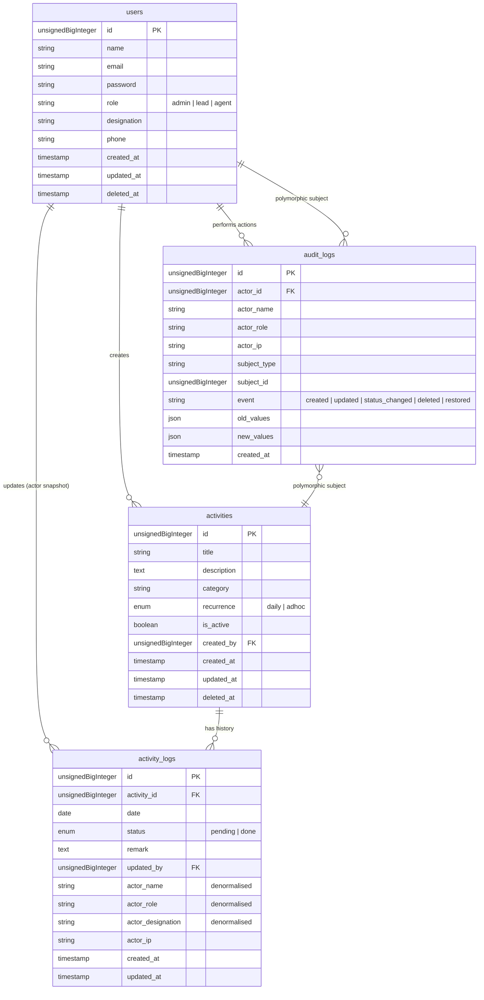

# Architecture — Support Activity Tracker

This document describes the architectural layout, entity relationships, database schema, and security enforcement mechanisms for the Npontu Technologies Support Activity Tracker.

---

## 1. Entity-Relationship Diagram (ERD)

The diagram below defines the relationships between the database entities. Note that `activity_logs` represents the append-only history of activity state changes, whereas `audit_logs` is the compliance/security audit trail.



---

## 2. Module Boundaries

The application is structured using a clean, layered architectural pattern matching the requirements in `AGENTS.md`:

```
┌────────────────────────────────────────────────────────┐
│                      HTTP Layer                        │
│   (Controllers / Request Validation / Livewire Views)   │
└──────────────────────────┬─────────────────────────────┘
                           │
                           ▼
┌────────────────────────────────────────────────────────┐
│                    Business Actions                    │
│           (CreateActivityAction, etc.)                 │
└────────────┬─────────────────────────────┬─────────────┘
             │                             │
             ▼                             ▼
┌────────────────────────┐     ┌─────────────────────────┐
│     Domain Models      │     │    Compliance Audit     │
│   (Activity, User)     │     │     (AuditService)      │
└────────────────────────┘     └─────────────────────────┘
```

### Components

| Component | Responsibility |
|---|---|
| **Auth** | Handles sign-in form rendering, credential validation, session creation, and secure logout. |
| **Activities** | Manages creating, updating details, deleting (soft-delete), and status updating. |
| **Reporting** | Performs date-range queries over activity history and handles status filtering. |
| **Audit** | Write-only compliance service recording every user mutation. |
| **Admin** | User management features restricted strictly to the `admin` role. |

---

## 3. Request Lifecycle

The diagram below details the sequence of execution when a user updates an activity's status:

```
[Browser]             [Livewire Component]         [Action Class]          [AuditService]          [Database]
    │                          │                         │                       │                     │
    │───(Submit Status/Remark)─>                         │                       │                     │
    │                          │───(Validate Input)─────>│                       │                     │
    │                          │                         │───(Create Log Row)───>│                     │
    │                          │                         │                       │────────────────────>│
    │                          │                         │───(Log Audit)────────>│                     │
    │                          │                         │                       │───(Create Entry)───>│
    │                          │                         │                       │                     │
    │                          │<──(Return Fresh State)──│                       │                     │
    │<──(Refresh HTML view)────│                         │                       │                     │
```

---

## 4. Database Schema (Detailed)

### Key Indexes

- `activities.is_active` & `activities.category` - speeds up retrieval of active items on the board.
- `activity_logs.date + activity_logs.activity_id` (composite) - supports rendering daily boards quickly.
- `activity_logs.date + activity_logs.status` (composite) - speeds up history reporting.
- `audit_logs.subject_type + audit_logs.subject_id` - supports polymorphic morphTo queries.
- `audit_logs.created_at` - enables timeline sorting.

---

## 5. Security Architecture

### Role Enforcement Points

| Route / Capability | Action / Middleware | Authorized Roles |
|---|---|---|
| Access Application | `auth` middleware | All authenticated users |
| View Activity Board | `ActivityPolicy@viewAny` | `admin`, `lead`, `agent` |
| Create Activity | `ActivityPolicy@create` | `admin`, `lead` |
| Edit Activity | `ActivityPolicy@update` | `admin`, `lead` |
| Update Status & Remark | `ActivityPolicy@updateStatus` | All authenticated users |
| Delete Activity | `ActivityPolicy@delete` | `admin` |
| Manage Users | `admin` prefix + `role:admin` | `admin` |

---

## 6. Architecture Decisions & Resolving Open Questions

1. **Role Storage**: Roles are stored as a `role` string column (`admin`, `lead`, `agent`) on the `users` table.
2. **Soft Deletes**: Soft-delete is active on `activities` and `users` to ensure historical logs/reports are never broken by model deletions.
3. **Activity Updates Format**: Every status change generates an append-only row in `activity_logs` rather than performing in-place updates. This ensures the full handover timeline can be drawn.
