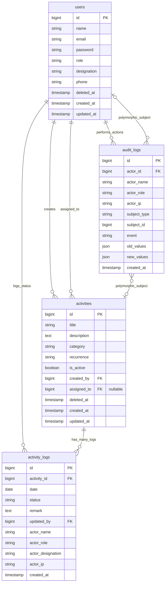
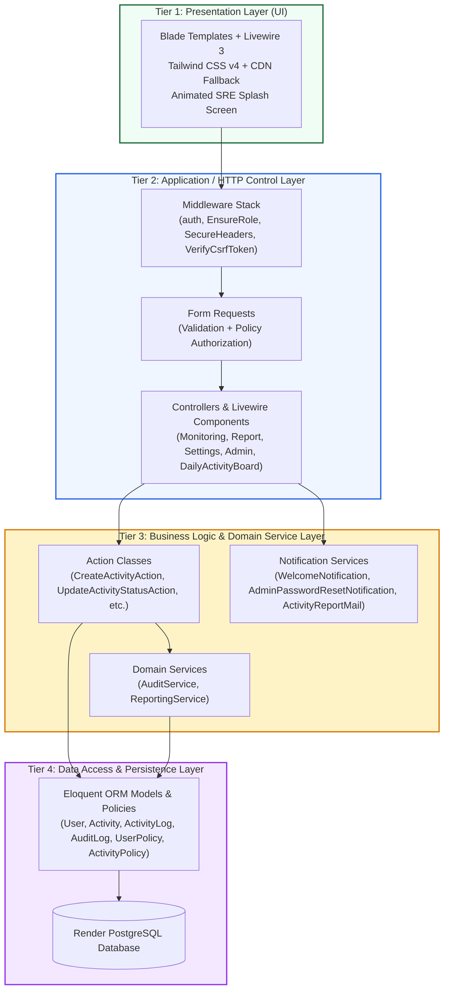
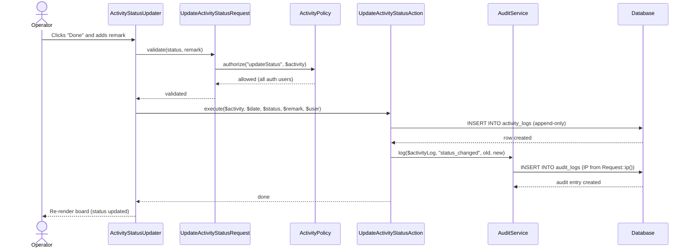
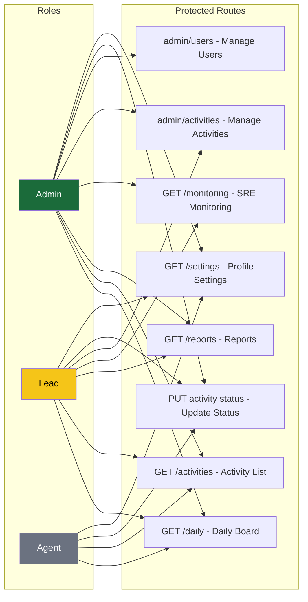
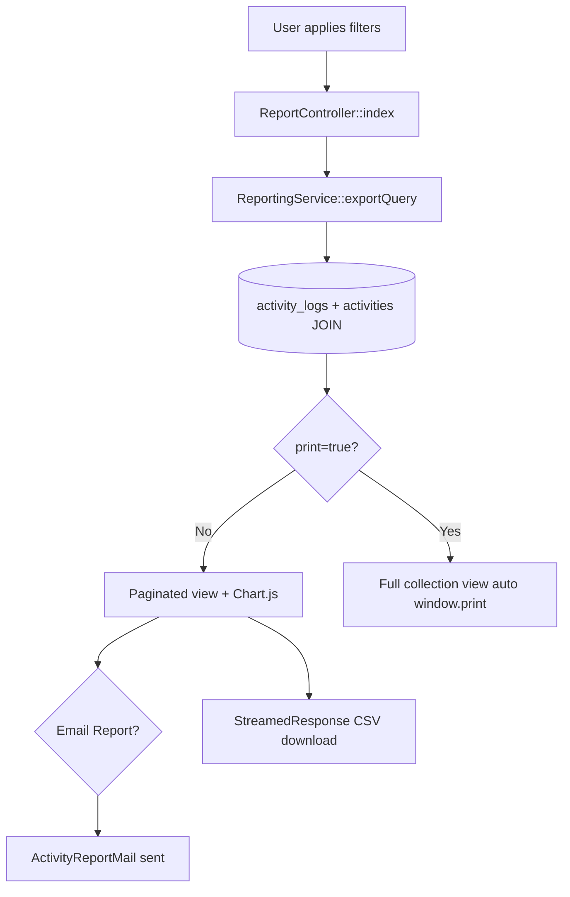
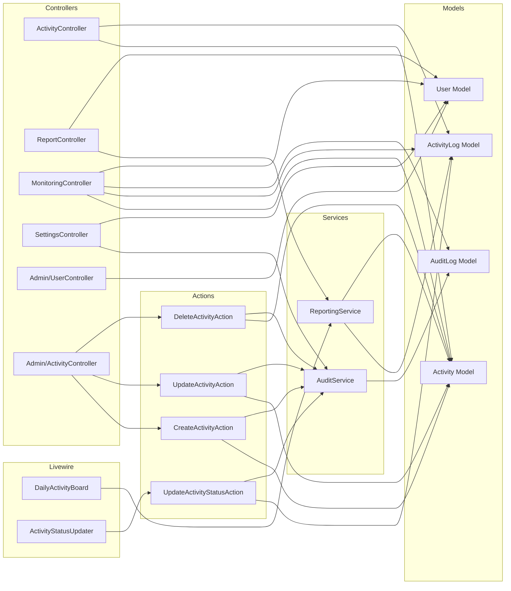
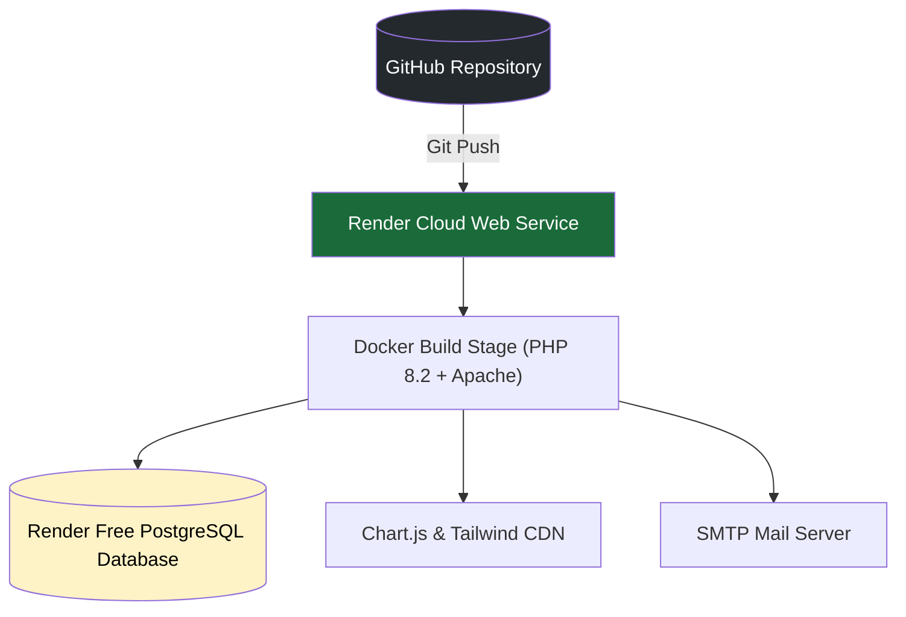
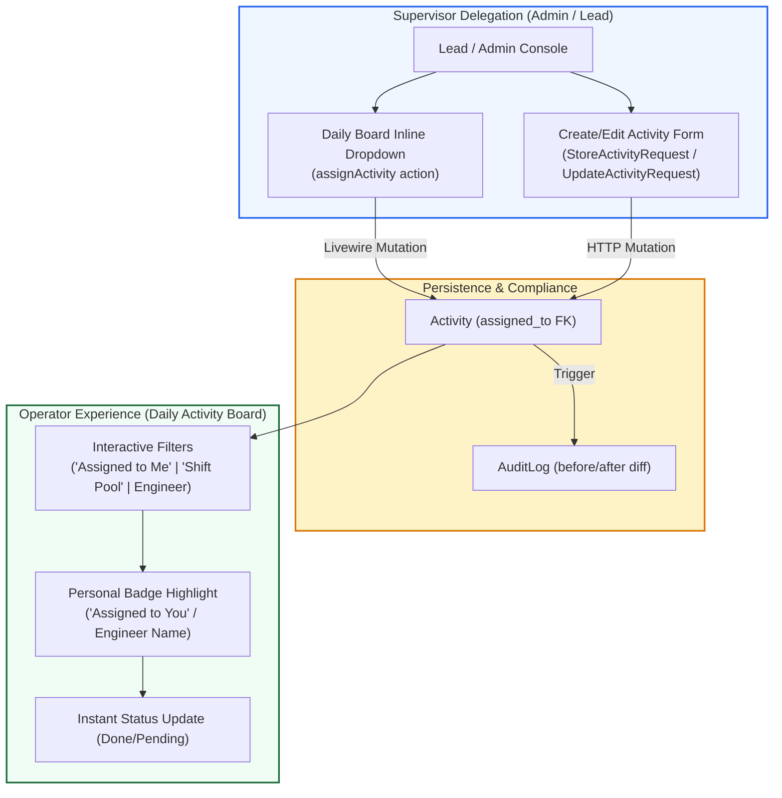

# Architecture — Support Activity Tracker

> Visual reference for the system architecture using Mermaid diagrams.
> All diagrams render natively in GitHub, VS Code, and most modern Markdown viewers.

---

## 1. Entity-Relationship Diagram (ERD)

Relationships between the four main database tables. `activity_logs` is an append-only event store;
`audit_logs` is the polymorphic security/compliance log.

---

## 2. 4-Tier Application Architecture

The system is engineered using an enterprise **4-Tier Architecture** pattern to isolate UI presentation, HTTP control flow, core business execution, and database persistence.

### 4-Tier Breakdown & Key Responsibilities

| Tier | Component | Responsibility |
|---|---|---|
| **Tier 1: Presentation** | Blade, Livewire, Tailwind | Renders rich responsive dashboards, splash screens, real-time polling UI, and PDF report layouts. |
| **Tier 2: Application / HTTP** | Middleware, FormRequests, Controllers | Guards routes (RBAC), validates incoming payloads, handles session auth, and delegates requests. |
| **Tier 3: Business & Services** | Actions, Services, Mail/Notifications | Contains single-responsibility business logic, audit trail recording, reporting algorithms, and automated email dispatches. |
| **Tier 4: Data Persistence** | Eloquent Models, Policies, PostgreSQL | Handles ORM relationships, soft-delete scopes, polymorphic morphs, schema migrations, and database queries. |

---

## 3. Request Lifecycle — Status Update Flow

Detailed sequence of what happens when an operator marks an activity as Done.

---

## 4. Role-Based Access Control (RBAC) Map

Which roles can access which routes and perform which actions.

---

## 5. Data Flow — Report Generation

How a date-range report is built, rendered, printed and emailed.

---

## 6. Module Dependency Graph

Shows which application modules depend on which other modules.

---

## 7. Deployment Architecture (Render.com + Docker)

---

## 8. Security Enforcement Chain

Every request passes through multiple security checkpoints.

```mermaid
flowchart LR
    Req["HTTP Request"]
    CORS["HandleCors"]
    CSRF["VerifyCsrfToken"]
    Auth["Authenticate (auth)"]
    Role["EnsureRole (admin, lead)"]
    Policy["Laravel Policy"]
    Ctrl["Controller / Action"]
    Audit["AuditService"]

    Req --> CORS
    CORS --> CSRF
    CSRF --> Auth
    Auth --> Role
    Role --> Policy
    Policy --> Ctrl
    Ctrl --> Audit

    style Auth fill:#2563eb,color:#fff
    style Role fill:#F5C518,color:#000
    style Policy fill:#9333ea,color:#fff
    style Audit fill:#1B6B3A,color:#fff
```

---

---

## 9. Task Assignment & Delegation Architecture

Allows Team Leads and Administrators to optionally delegate operational checks to specific engineers while maintaining a general shift pool for unassigned tasks.

---

## Architecture Decisions Log

| # | Decision | Chosen | Rejected | Rationale |
|---|---|---|---|---|
| 1 | Frontend reactivity | Livewire 3 | Inertia/React | No JS build pipeline; wire:poll handles live updates; PHP-only codebase |
| 2 | Status storage | Append-only `activity_logs` | Mutable status column | Preserves full timeline for shift handover and audit |
| 3 | Audit logging | Separate `audit_logs` table | Embedding in `activity_logs` | Different consumers: domain log vs security/SIEM log |
| 4 | Actor identity | Server-captured from Auth session | Client-submitted | Prevents bio spoofing |
| 5 | Soft deletes | `SoftDeletes` on Activity + User | Hard delete | Historical logs must not break when records are removed |
| 6 | Role system | String column + Policy | Spatie Permissions | YAGNI — 3 roles, fixed boundaries; no permission matrix needed |
| 7 | Monitoring access | Admin + Lead only | All users | Audit trails contain sensitive IP and change data |
| 8 | Database (production) | Render PostgreSQL | SQLite / MySQL | High durability, relational integrity, connection pooling on Render |
| 9 | Task Delegation | Optional Nullable FK (`users.id`) | Separate Team/Assignment Pivot | Preserves shift pool elasticity (null = shift pool) while giving 1-click personal accountability without relational overhead |
