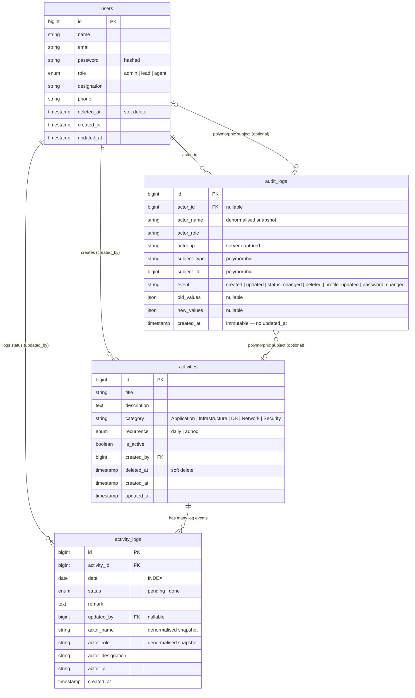
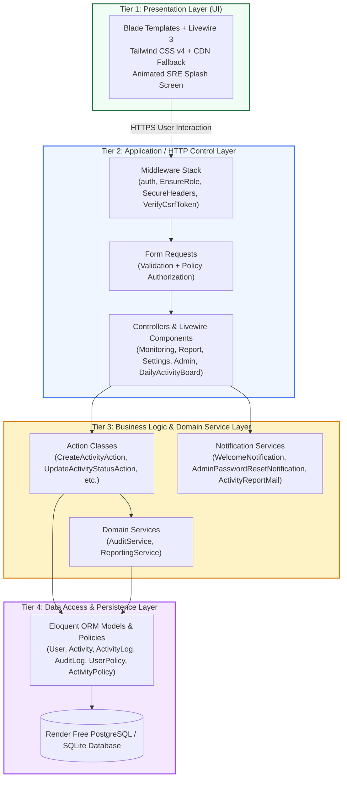
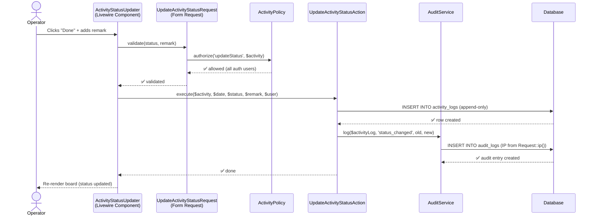
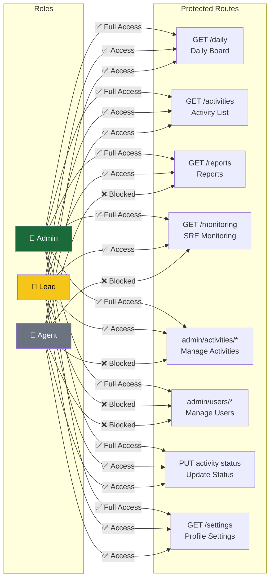
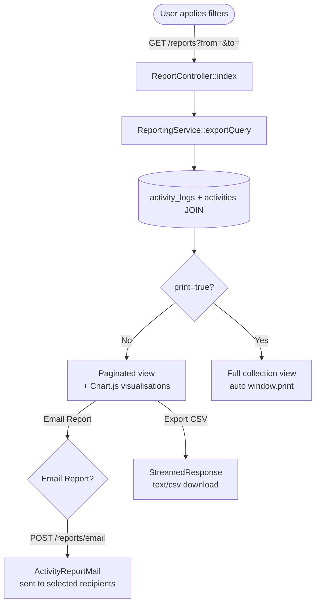
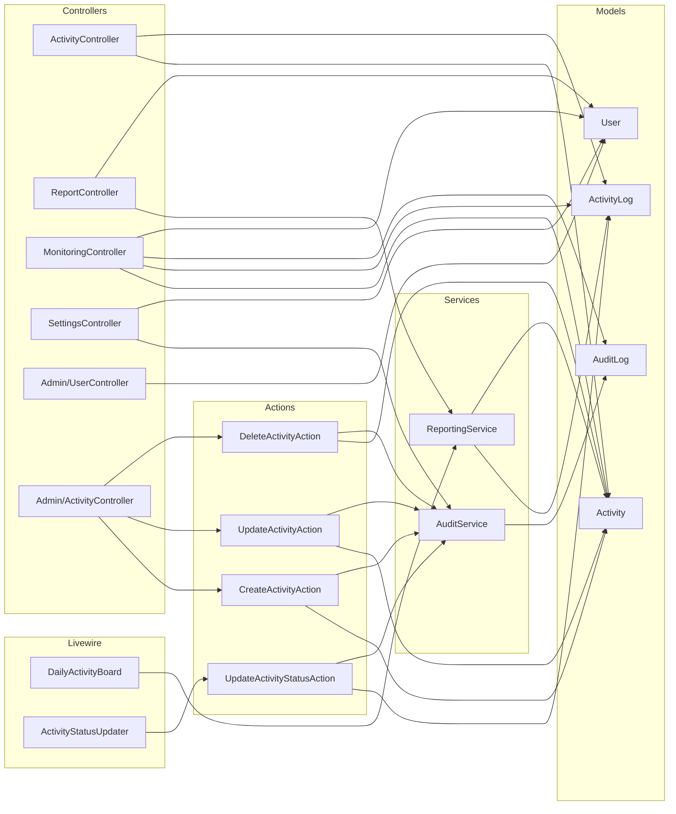

# Architecture — Support Activity Tracker

> Visual reference for the system architecture using Mermaid diagrams.
> All diagrams render natively in GitHub, VS Code, and most modern Markdown viewers.

---

## 1. Entity-Relationship Diagram (ERD)

Relationships between the four main database tables. `activity_logs` is an append-only event store;
`audit_logs` is the polymorphic security/compliance log.



---

## 2. 4-Tier Application Architecture

The system is engineered using a enterprise **4-Tier Architecture** pattern to isolate UI presentation, HTTP control flow, core business execution, and database persistence.



### 4-Tier Breakdown & Key Responsibilities

| Tier | Component | Responsibility |
|---|---|---|
| **Tier 1: Presentation** | Blade, Livewire, Tailwind | Renders rich responsive dashboards, splash screens, real-time polling UI, and PDF report layouts. |
| **Tier 2: Application / HTTP** | Middleware, FormRequests, Controllers | Guards routes (RBAC), validates incoming payloads, handles session auth, and delegates requests. |
| **Tier 3: Business & Services** | Actions, Services, Mail/Notifications | Contains single-responsibility business logic, audit trail recording, reporting algorithms, and automated email dispatches. |
| **Tier 4: Data Persistence** | Eloquent Models, Policies, PostgreSQL | Handles ORM relationships, soft-delete scopes, polymorphic morphs, schema migrations, and database queries. |

---

## 3. Request Lifecycle — Status Update Flow

Detailed sequence of what happens when an operator marks an activity as Done.



---

## 4. Role-Based Access Control (RBAC) Map

Which roles can access which routes and perform which actions.



---

## 5. Data Flow — Report Generation

How a date-range report is built, rendered, printed and emailed.



---

## 6. Module Dependency Graph

Shows which application modules depend on which other modules.



---

## 7. Deployment Architecture (Render.com)

```mermaid
flowchart TB
    GH[(GitHub\nmhiskall282/npontu-technologies-sre)]
    R[Render Web Service\nnpontu-support-tracker]
    BS[build.sh\ncomposer install\nnpm run build\nartisan cache]
    SS[Start Command\nartisan migrate --force\nheroku-php-apache2 public/]
    D[/var/data/database.sqlite\n1 GB Persistent Disk]
    APP[Laravel Application\nPort 10000]
    CDN[Chart.js CDN\njsdelivr.net]
    SMTP[SMTP Mail Provider\ne.g. Mailtrap / SendGrid]

    GH -->|git push triggers deploy| R
    R --> BS
    BS --> SS
    SS --> D
    SS --> APP
    APP --> CDN
    APP --> SMTP

    style GH fill:#24292e,color:#fff
    style R fill:#46E3B7,color:#000
    style D fill:#fef3c7,color:#000
```

---

## 8. Security Enforcement Chain

Every request passes through multiple security checkpoints.

```mermaid
flowchart LR
    Req([HTTP Request])
    CORS[HandleCors]
    CSRF[VerifyCsrfToken]
    Auth[Authenticate\nauth middleware]
    Role[EnsureRole\nrole:admin,lead]
    Policy[Laravel Policy\nauthorize call]
    Ctrl[Controller\nAction]
    Audit[AuditService\nwrite audit log]

    Req --> CORS --> CSRF --> Auth
    Auth -->|Not logged in| Redirect[/login redirect]
    Auth -->|Logged in| Role
    Role -->|Wrong role| 403[403 Forbidden]
    Role -->|Correct role| Policy
    Policy -->|Unauthorized| 403b[403 Forbidden]
    Policy -->|Authorized| Ctrl
    Ctrl --> Audit

    style Redirect fill:#E63946,color:#fff
    style 403 fill:#E63946,color:#fff
    style 403b fill:#E63946,color:#fff
    style Audit fill:#1B6B3A,color:#fff
```

---

## Architecture Decisions Log

| # | Decision | Chosen | Rejected | Rationale |
|---|---|---|---|---|
| 1 | Frontend reactivity | Livewire 3 | Inertia/React | No JS build pipeline; wire:poll handles live updates; PHP-only codebase |
| 2 | Status storage | Append-only `activity_logs` | Mutable status column | Preserves full timeline for shift handover and audit |
| 3 | Audit logging | Separate `audit_logs` table | Embedding in `activity_logs` | Different consumers: domain log vs security/SIEM log |
| 4 | Actor identity | Server-captured from Auth session | Client-submitted | Prevents bio spoofing |
| 5 | Soft deletes | `SoftDeletes` on Activity + User | Hard delete | Historical logs must not break when records are removed |
| 6 | Role system | String column + Policy | Spatie Permissions | YAGNI — 3 roles, fixed boundaries; no permission matrix needed |
| 7 | Monitoring access | Admin + Lead only | All users | Audit trails contain sensitive IP and change data |
| 8 | Database (production) | SQLite + Render disk | Managed MySQL | Zero additional cost on Render free tier; acceptable for small team |
