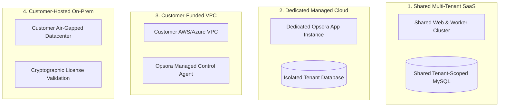

# Opsora Deployment Topologies & Infrastructure Abstraction

> **Status:** IMPLEMENTED  
> **Last Verified:** 2026-09-18

Opsora supports four distinct deployment topologies to accommodate organizations ranging from early-stage startups to strictly regulated fintech and banking institutions.

---

## 1. Supported Deployment Topologies

| Deployment Model | Key Characteristics | Target Customer Tier | Data Isolation Mechanism |
|---|---|---|---|
| `shared_saas` | Multi-tenant cluster on Render / AWS | Startups, SMBs, Teams | Shared DB + `TenantScope` logical isolation |
| `dedicated_managed` | Opsora-managed isolated instance & DB | Growth companies, HealthTech | Dedicated MySQL instance / VPC |
| `customer_funded` | Provisioned inside customer cloud account | Fintech, Financial Institutions | Customer AWS/Azure VPC boundary |
| `customer_hosted` | Deployed in on-premise datacenter | Government, Defense, Telco | Air-gapped container stack + license key |
