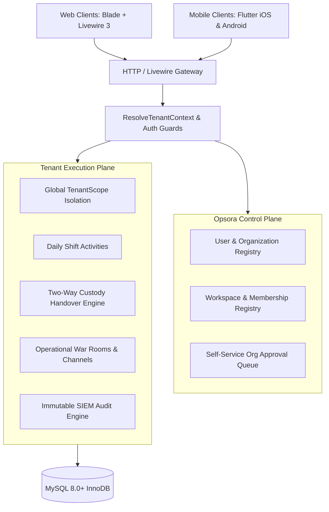

# Opsora Architecture — High-Level Overview

> **Status:** IMPLEMENTED  
> **Last Verified:** 2026-09-18

Opsora is designed as a **modular monolith** optimized for Site Reliability Engineering and operational workflow management. It separates control plane concerns (identity, organizations, workspace registry) from execution plane concerns (daily checklists, shift handovers, incident escalations, and war rooms).

---

## 1. High-Level Architectural Layers

---

## 2. Core Architectural Decisions
1. **Modular Monolith**: Single codebase maintaining Laravel backend and Flutter mobile client, avoiding premature microservice complexity while enforcing strict domain boundaries.
2. **Multi-Tenancy via Workspace Context**: Tenant scoping is rooted in `workspaces`. Users belong to Organizations, and Organizations own one or more Workspaces. Users can also have individual personal workspaces.
3. **Database-Level Isolation**: All operational tables (`activities`, `activity_logs`, `shift_handovers`, `conversations`, `operational_notifications`, `audit_logs`) carry a `workspace_id` foreign key with compound indexes.
4. **Append-Only Audit Trail**: State mutations generate immutable audit records that cannot be edited or deleted by any user or administrator.

---

## 3. Dual-Client Application Ecosystem

Opsora SRE provides two specialized client experiences tailored to different operational contexts:

| Domain | Web Cockpit & Control Plane | Mobile Companion App |
|---|---|---|
| **Location** | Root repository (`resources/views/`, `app/`) | `npontu_sre_mobile/` |
| **Technology** | Laravel 11/12 LTS, Livewire 3, Blade, Tailwind CSS v3 | Flutter 3.24+, Dart 3.5+, Riverpod, Dio, SecureStorage |
| **Primary Context** | NOC command center, dual-monitor desks, supervisory review | On-call engineers, roving supervisors, standby response |
| **Authentication** | Session cookie + CSRF token | Sanctum Bearer tokens (AES-GCM KeyStore / Keychain) |
| **Tenant Routing** | Path & session context (`/workspaces/{uuid}/switch`) | Automated `X-Workspace-Id` header injection interceptor |
| **Telemetry View** | Standalone public status dashboard (`/health`), 7-day latency charts | Real-time 3-second HUD streaming & offline cached metrics |
| **Key Features** | Administrative SaaS Control Plane, impersonation, automated PDF/CSV reports, war rooms | Biometric launch, instant blocker logging, on-call handover sign-off |

