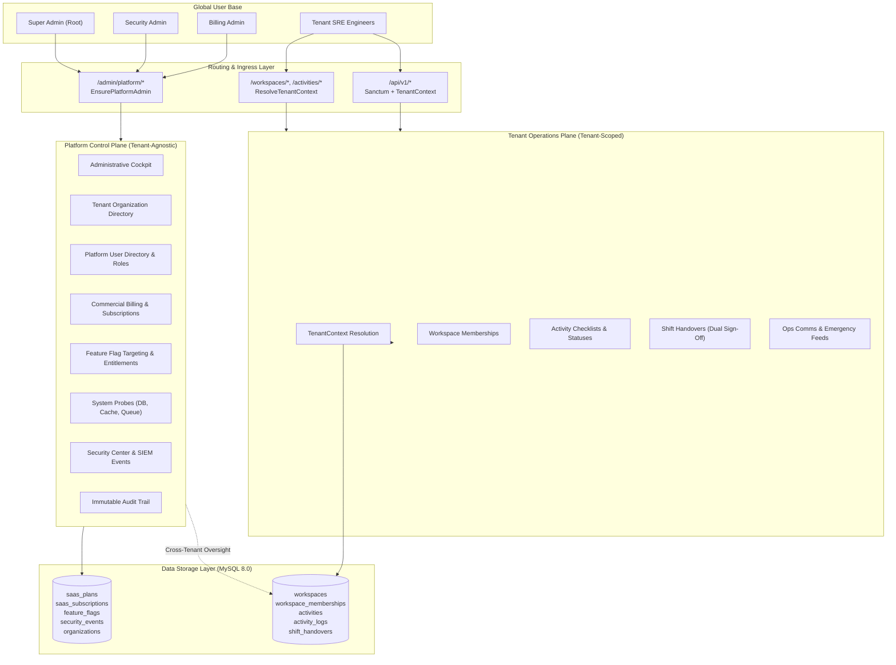
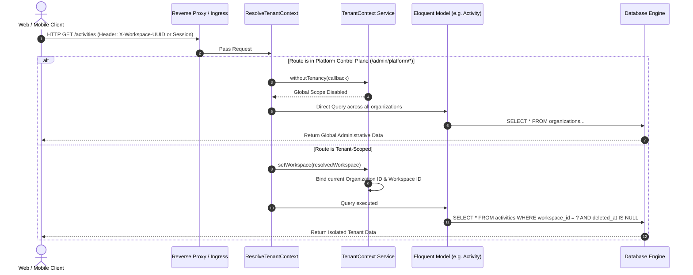
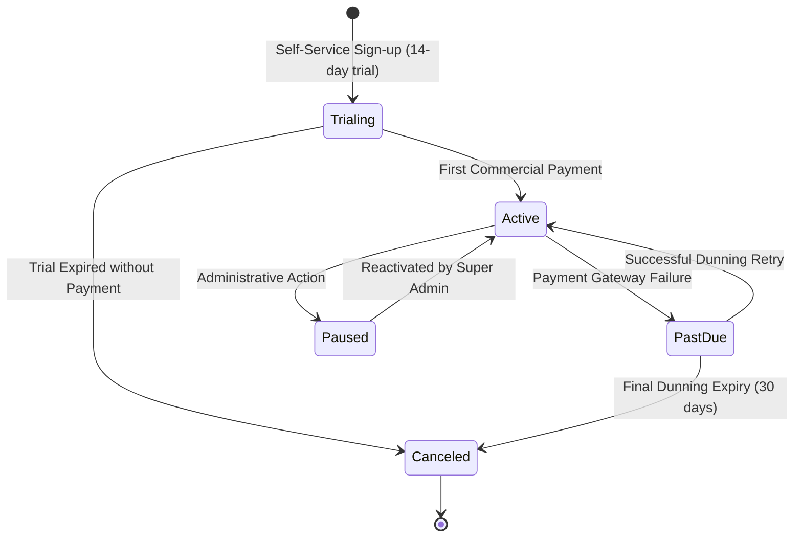
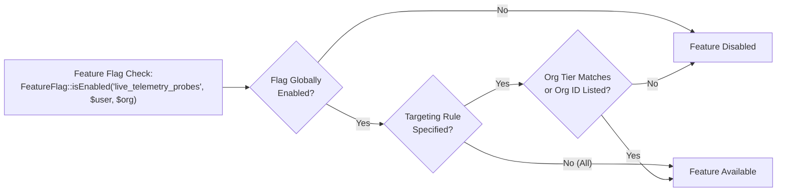
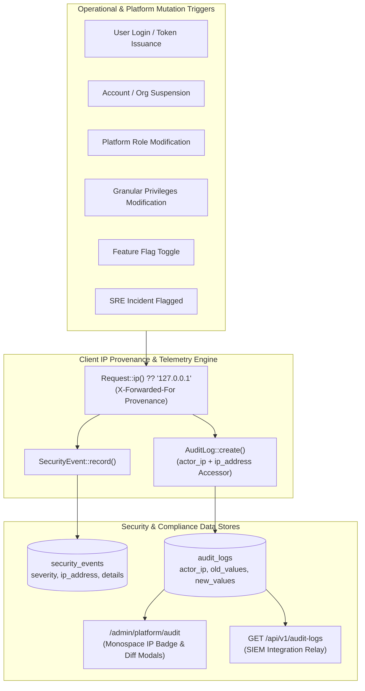
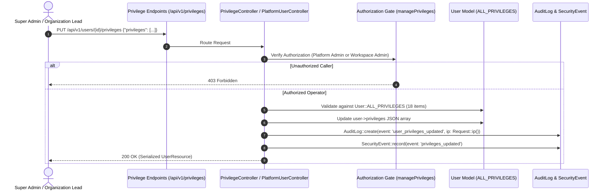
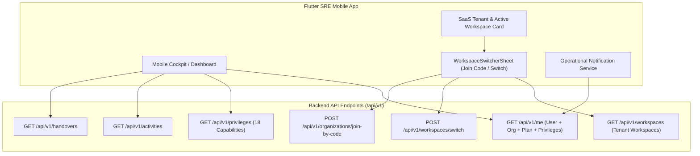

# Opsora SaaS Control Plane & Multi-Tenant Platform Architecture

> **Document Class**: Enterprise Architecture Specification  
> **System**: Opsora Site Reliability Engineering SaaS Platform  
> **Classification**: Internal Platform Engineering Document  
> **Status**: Approved & Implemented

---

## 1. Architectural Foundations & Domain Separation

The Opsora SRE platform enforces a strict architectural partition between the **Platform Control Plane** and the **Tenant Operations Plane**.

---

## 2. Multi-Tenant Request Resolution & Isolation Model

### 2.1 Resolution Flow & Context Binding
Every request entering the application traverses the `ResolveTenantContext` middleware.

### 2.2 Row-Level Security & Global Scope Enforcement
Tenant data isolation is enforced through Laravel Eloquent Global Scopes:
- Any model extending tenant awareness automatically attaches `where('workspace_id', TenantContext::getWorkspaceId())`.
- In the Control Plane, all queries run inside `TenantContext::withoutTenancy(fn () => ...)`, guaranteeing that administrative metrics reflect real system-wide totals without leaking into tenant user sessions.

---

## 3. Commercial Subscriptions, Tiers & Feature Flags

### 3.1 Subscription State Machine & Entitlements
Commercial accounts are linked through `saas_subscriptions` referencing `saas_plans`.

### 3.2 Dynamic Feature Flag Targeting Pipeline

---

## 4. SIEM Security Telemetry & Immutable Audit Trail Architecture

Security telemetry is captured synchronously on all operational and platform-level mutations via `SecurityEvent::record(...)` and `AuditService::log(...)`. Every mutation captures authenticated actor snapshot details, state diff payloads, and verifiable client IP address provenance.

---

## 5. Granular User Privileges & Fleet RBAC Governance

Opsora decouples tenant user roles (`admin`, `lead`, `agent`) from platform administrative roles (`PlatformRole`), enabling fine-grained operational authorizations across 18 specialized enterprise capabilities.

---

## 6. Mobile Hybrid SRE Ingress & WebSocket/Polling Architecture

The Flutter mobile application connects via REST and Livewire-compatible polling endpoints.

---

## 7. Architecture Verification & Quality Gates

The implementation conforms to the following strict operational metrics:
- **Zero Foreign Key Violations**: Cascading soft-deletes implemented across all tenant and platform models.
- **Strict Database Portability**: All SQL aggregation functions dynamically check the active driver (`sqlite`, `mysql`, `pgsql`).
- **Cryptographic Session Tokens**: Sanctum personal access tokens are hashed using SHA-256 and revocable from the Platform User Directory.
- **Contrast & Accessibility Compliance**: High-contrast typography palette strictly adheres to WCAG AA standards in both light and dark display modes.
