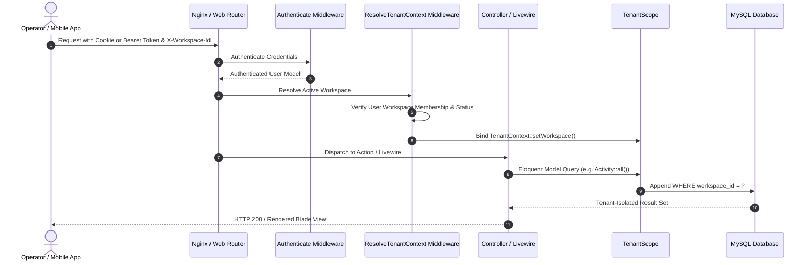

# Opsora System Architecture & Component Mapping

> **Status:** IMPLEMENTED  
> **Last Verified:** 2026-09-18

This document details the data and control flow across the Opsora system from client requests down to the database and background workers.

---

## 1. Request Lifecycle & Tenant Context Binding

---

## 2. Component Responsibility Matrix

| Subsystem | Primary Namespace | Responsibilities |
|---|---|---|
| **Identity & Access** | `App\Models\User`, `App\Models\Organization` | Account management, global personas, organization ownership |
| **Tenancy Resolution** | `App\Services\TenantContext`, `App\Http\Middleware\ResolveTenantContext` | Session/header workspace extraction, membership enforcement |
| **Operational Board** | `App\Livewire\DailyActivityBoard`, `App\Actions\Activity` | Checklist CRUD, bulk delegation, inline status updates |
| **Shift Custody** | `App\Models\ShiftHandover`, `App\Actions\Handover` | 2-phase shift sign-off, briefing notes, forensic locking |
| **Communications** | `App\Livewire\OperationalChat`, `App\Models\Conversation` | Channel dispatch, direct messages, attachments |
| **Audit Engine** | `App\Services\AuditService`, `App\Models\AuditLog` | Forensic immutable logging with actor snapshots |
| **Health Telemetry** | `App\Http\Controllers\HealthController`, `App\Services\SystemHealthService` | Real-time probes, DB latency metrics, public health endpoint |
