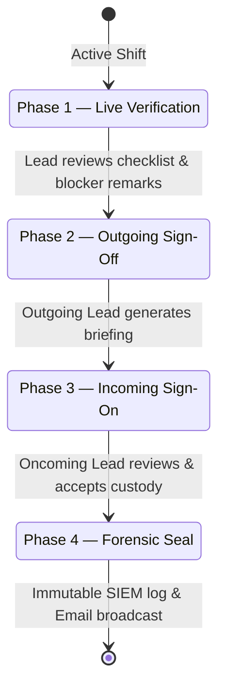

# Opsora Product — Two-Way Shift Handover Protocol

> **Status:** IMPLEMENTED  
> **Route:** `/handovers` & `/reports/handovers`

Opsora eliminates broken on-call shifts through a **4-phase mathematical custody transfer contract**.

---

## 1. Handover Protocol Sequence

1. **Live Verification**: Review unresolved checklist items and confirm system telemetry is green.
2. **Outgoing Sign-Off**: Outgoing lead summarizes the shift, records blockers, and initiates transfer.
3. **Incoming Sign-On**: Oncoming lead acknowledges active tickets, enters acceptance remarks, and signs on.
4. **Forensic Seal**: The database stamps `accepted_by_id`, `accepted_at`, and seals the record as immutable.
