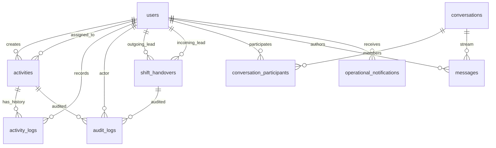

# Opsora SaaS Transformation — Current State Architecture Audit

> **Stage**: Stage 0 (Safety Baseline & Repository Audit)  
> **Repository**: `https://github.com/mhiskall282/npontu-technologies-sre`  
> **Frameworks**: Laravel 11 LTS (PHP 8.2+), Livewire 3, Flutter 3.24+ (Dart 3.5+)  
> **Database**: MySQL 8.0+ (InnoDB)  
> **Current Testing Status**: 109 PHP Pest tests passed (541 assertions), 22 Flutter tests passed.

---

## 1. Existing System Architecture Overview

The system is currently structured as a clean, high-discipline Laravel 11 modular monolith alongside a feature-first Flutter mobile application.

```
┌─────────────────────────────────────────────────────────────────────────┐
│                           CLIENT ACCESS LAYER                           │
├────────────────────────────────────┬────────────────────────────────────┤
│  Web Application                   │  Mobile Companion                  │
│  - Blade + Livewire 3 Components   │  - Flutter 3.24+ (Android & iOS)   │
│  - Tailwind CSS v3                 │  - Riverpod State Management       │
│  - Alpine.js Micro-Interactions    │  - Dio Networking & GoRouter       │
└──────────────────┬─────────────────┴──────────────────┬─────────────────┘
                   │                                    │
                   ▼                                    ▼
       ┌──────────────────────┐             ┌──────────────────────┐
       │ Web Routes (Session) │             │ API v1 (Sanctum)     │
       │ - /daily, /messages  │             │ - Bearer Token Auth  │
       │ - /reports, /admin   │             │ - JSON API Resources │
       └──────────┬───────────┘             └──────────┬───────────┘
                  │                                    │
                  └─────────────────┬──────────────────┘
                                    ▼
                    ┌───────────────────────────────┐
                    │    SHARED DOMAIN ARCHITECTURE │
                    │ - Action Classes (Single-Resp)│
                    │ - Service Layer (Coordination)│
                    │ - Form Requests & Policies    │
                    │ - Immutable Audit Trail       │
                    └───────────────┬───────────────┘
                                    ▼
                    ┌───────────────────────────────┐
                    │   DATABASE & INFRASTRUCTURE   │
                    │ - MySQL 8.0+ (InnoDB Engine)  │
                    │ - Database Queue & Cache      │
                    │ - Local/Blob File Storage     │
                    │ - Render.com Cloud Hosting    │
                    └───────────────────────────────┘
```

---

## 2. Inventory of Single-Company Assumptions

The current application operates as a single-organization SRE cockpit. The following architectural assumptions exist in the code:

1. **Global User Table (`users`)**:
   - `role` enum (`admin`, `lead`, `agent`) is defined directly on the `users` row. In a multi-tenant platform, a user's role must be scoped to an organization or workspace.
   - User belongs to a single global system rather than having memberships in multiple organizations.
2. **Global Activity Table (`activities`)**:
   - `activities` rows belong only to `user_id` (creator) and `assigned_to` (assignee). There is no `tenant_id`, `organization_id`, or `workspace_id`.
   - Global queries (`Activity::where('date', $date)->get()`) fetch all checks for that day across the entire database without organizational isolation.
3. **Global Shift Handovers (`shift_handovers`)**:
   - Outgoing lead (`outgoing_user_id`) hands off to incoming lead (`incoming_user_id`) on the single global system timeline.
4. **Global Channels & War Rooms (`conversations`)**:
   - Channels such as `#general-shift` are provisioned globally. All authenticated users can see public channels across the single deployment.
5. **Global System Health (`/health`)**:
   - Health probes check the single database connection and queue.
6. **Global Audit Trail (`audit_logs`)**:
   - Audit logs capture `actor_id` and subject morphs globally without a tenant partition key.

---

## 3. Database Schema & Relationship Map



---

## 4. Reusable Core Assets

The following existing components adhere strictly to Clean Architecture and will be reused without modification:

| Component | Location | Role in SaaS Transformation |
|---|---|---|
| `AuditService` | `app/Services/AuditService.php` | Extended with optional `tenant_id` / `workspace_id` context while preserving identical call signature. |
| `SystemHealthService` | `app/Services/SystemHealthService.php` | Extended to inspect tenant-specific database and deployment health. |
| `ReportingService` | `app/Services/ReportingService.php` | Wrapped with workspace scoping parameters to guarantee tenant isolation during report generation. |
| `EmailReplyTokenService` | `app/Services/EmailReplyTokenService.php` | Extended to bind cryptographic reply tokens to tenant context. |
| `ActivityPolicy` | `app/Policies/ActivityPolicy.php` | Augmented with workspace membership checks (`canAccessWorkspace`). |
| `UserPolicy` | `app/Policies/UserPolicy.php` | Scoped to organization management authorization. |
| Action Classes | `app/Actions/Activity/*` | Injected with workspace context for all mutations. |

---

## 5. Security & Isolation Baseline

- **CSRF**: Enforced across all web forms.
- **Mass Assignment**: All models declare `$guarded = ['id']`.
- **Authorization**: Controller and API endpoints enforce Policy gates via Form Requests and `$this->authorize(...)`.
- **Audit Trail**: Every state mutation triggers `AuditService::record(...)` with denormalized actor bio snapshots.
- **Sanctum Authentication**: API tokens verified with `auth:sanctum` guard.
- **Reversible Migrations**: All 16 existing database migrations implement `down()` methods.
